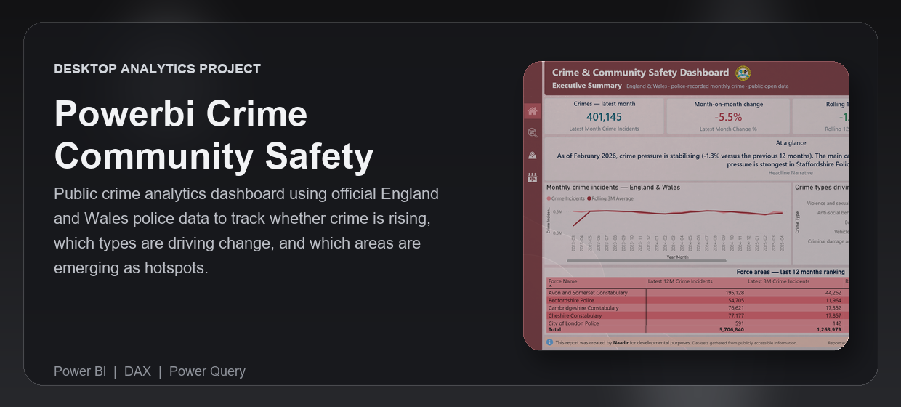
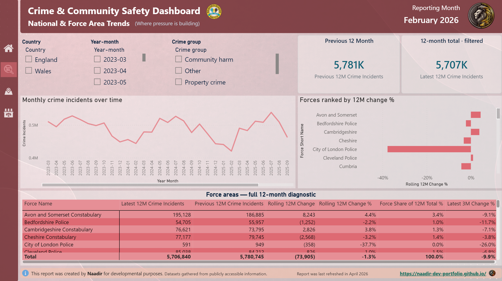
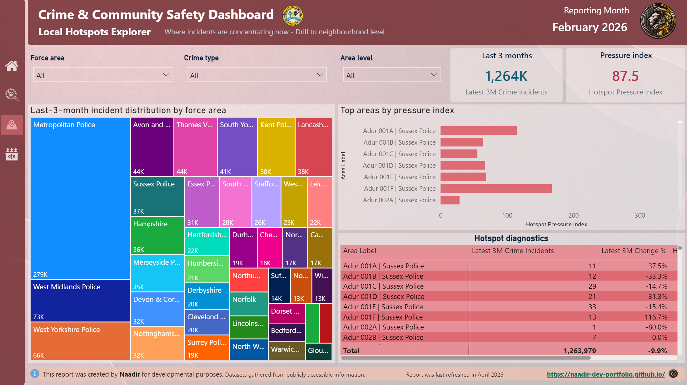
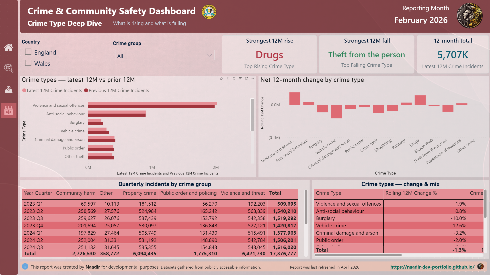

---
<div align="center">


<br /><br />

<p><strong>Public crime analytics dashboard using official England and Wales police data to track whether crime is rising, which types are driving change, and which areas are emerging as hotspots.</strong></p>

<p>Built for public-data portfolio reviewers, analysts, and civic stakeholders who need a clear view of changing crime pressure without manually wrangling millions of police records.</p>

<p><strong>Technical documentation:</strong> <a href="https://naadir-dev-portfolio.github.io/powerbi-crime-community-safety-dashboard/">View the published report documentation</a></p>

<p>
  <a href="#overview">Overview</a> |
  <a href="#what-problem-it-solves">What It Solves</a> |
  <a href="#feature-highlights">Features</a> |
  <a href="#screenshots">Screenshots</a> |
  <a href="#quick-start">Quick Start</a> |
  <a href="#tech-stack">Tech Stack</a>
</p>

<h3><strong>Made by Naadir | May 2026</strong></h3>

</div>

---

## Overview

This project is a Power BI portfolio dashboard built around official Police.uk open data for England and Wales. It turns monthly street-level crime records into a clean semantic model that shows whether crime pressure is rising, falling, or stabilising.

The workflow covers source-data download, raw file storage, curated model-table generation, DAX measure creation, and PBIP report-page setup. The dashboard is structured around four reporting views: executive summary, national and force-area trends, local hotspots, and crime-type deep dives.

The practical outcome is a public-interest analytics report that helps a viewer quickly understand the latest crime direction, the categories driving the movement, and the areas that need closer attention.

## What Problem It Solves

- Removes the need to manually download, combine, and reshape large monthly police files
- Replaces spreadsheet-heavy crime trend analysis with a repeatable Python and Power BI workflow
- Makes it clearer whether changes are broad-based or concentrated in specific crime types and areas
- Gives a cleaner portfolio-ready alternative to browsing raw open-data tables without context or measures

### At a glance

| Track | Analyse | Compare |
|---|---|---|
| Monthly crime volume across England and Wales | Rolling 3-month and 12-month movement | Police force areas and local LSOA-level areas |
| Official Police.uk street-level crime records | Crime mix, change rate, hotspot pressure, and contribution to change | Latest period versus previous period |
| Refreshable source-data pipeline | Power BI cards, trend charts, maps, ranking tables, and matrices | Crime categories, force areas, and local hotspots |

## Feature Highlights

- **Official open-data pipeline**, downloads Police.uk source files and stores raw data locally for repeatable refreshes
- **Curated model layer**, converts millions of raw crime records into Power BI-ready fact and dimension tables
- **Clean semantic model**, defines date, crime type, force, local area, and monthly crime fact tables with active relationships
- **Decision-focused DAX**, includes totals, rolling windows, latest snapshot comparisons, mix percentages, change drivers, and hotspot pressure measures
- **Local hotspot analysis**, supports area ranking and map-based exploration using latitude and longitude from the police data
- **PBIP report scaffold**, sets up the target Power BI pages so the remaining work is focused on visual placement and formatting

### Core capabilities

| Area | What it gives you |
|---|---|
| **Trend tracking** | A clear answer on whether crime is rising, falling, or stabilising over the latest periods |
| **Crime-type drivers** | Visibility into which categories are pushing the total up or down |
| **Geographic comparison** | Force-area and local-area comparison for hotspot detection |
| **Refreshable workflow** | Scripts that rebuild the curated model layer from official public source data |

## Screenshots

<details>
<summary><strong>Open screenshot gallery</strong></summary>

<br />

<div align="center">
  
  <br /><br />
  
  <br /><br />
  
</div>

</details>

## Quick Start

```bash
# Clone the repo
git clone https://github.com/Naadir-Dev-Portfolio/powerbi-crime-community-safety-dashboard.git
cd powerbi-crime-community-safety-dashboard

# Install dependencies
python -m pip install pandas requests

# Run
python "Source Data/scripts/run_pipeline.py"
```

No API keys are required. The pipeline uses public Police.uk open-data endpoints and writes raw files to `Source Data/raw` and curated model tables to `Curated Data`. Open `Crime Community Safety Dashboard.pbip` in Power BI Desktop after the pipeline runs, then refresh the model.

## Tech Stack

<details>
<summary><strong>Open tech stack</strong></summary>

<br />

| Category | Tools |
|---|---|
| **Primary stack** | `DAX` | `Power Query` |
| **UI / App layer** | `Power BI Desktop` | `PBIP` | `PBIR` |
| **Data / Storage** | `CSV` | `JSON` | `KML` | `Local files` |
| **Automation / Integration** | `Python` | `Police.uk open data API` | `Police.uk bulk archive` |
| **Platform** | `Windows` | `Power BI Desktop` |

</details>

## Architecture & Data

<details>
<summary><strong>Open architecture and data details</strong></summary>

<br />

### Application model

The project starts with official Police.uk source data: the rolling street-level crime archive, police force reference data, and force boundary files. Python scripts download the raw files into `Source Data/raw`, aggregate the monthly crime records, and produce a curated star-schema layer in `Curated Data`.

Power BI reads those curated CSV files through Power Query. The semantic model defines dimensions for date, crime type, police force, and local area, then connects them to a monthly crime fact table. DAX measures calculate total incidents, latest-month movement, rolling 3-month and 12-month change, crime mix, contribution to change, hotspot pressure, and headline narrative text.

### Project structure

```text
powerbi-crime-community-safety-dashboard/
+-- Crime Community Safety Dashboard.pbip
+-- Crime Community Safety Dashboard.Report/
+-- Crime Community Safety Dashboard.SemanticModel/
+-- Source Data/
+-- Curated Data/
+-- Documentation/
+-- project_map.html
+-- README.md
+-- repo-card.png
+-- portfolio/
    +-- crime-community-safety-dashboard.json
    +-- crime-community-safety-dashboard.webp
    +-- Screen1.png
    +-- Screen2.png
    +-- Screen3.png
```

### Data / system notes

- Source data comes from public Police.uk endpoints and requires no account, token, or paid service
- The detailed local-area crime archive currently covers March 2023 to February 2026 in the downloaded source snapshot
- Raw downloads and curated extracts are local files and are ignored from source control because they can be large
- The model keeps Greater Manchester in the force dimension from the official force list, but the current Police.uk archive snapshot does not include Greater Manchester fact rows

</details>

## Contact

Questions, feedback, or collaboration: `naadir.dev.mail@gmail.com`

<sub>DAX | Power Query</sub>

---
